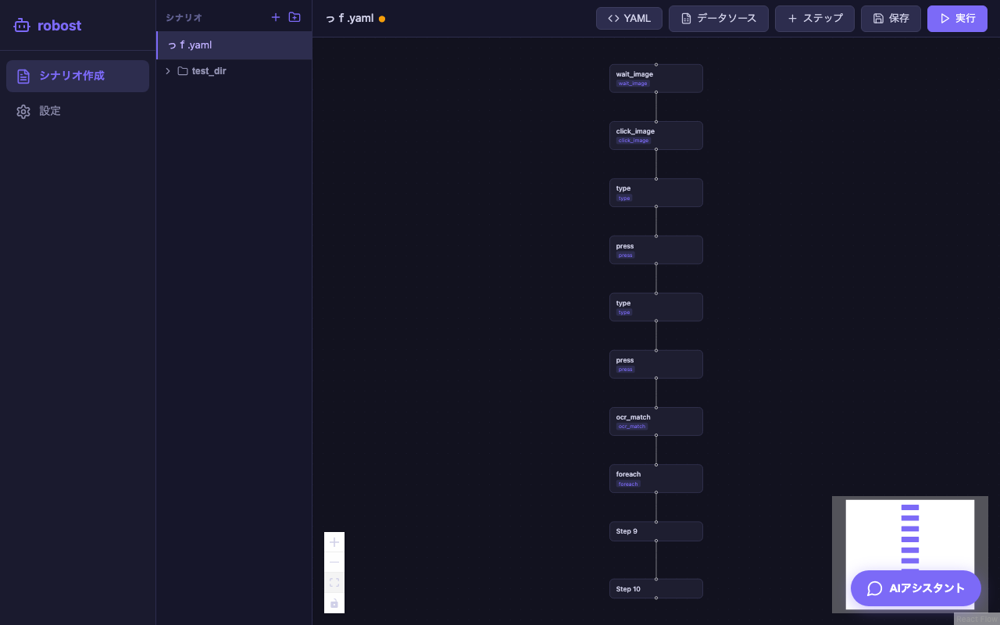
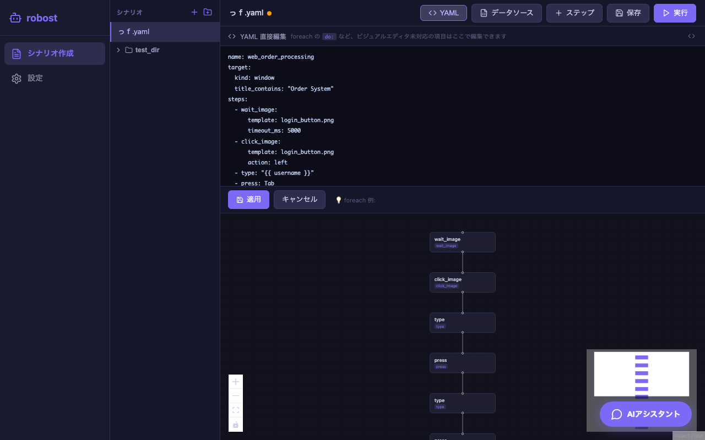
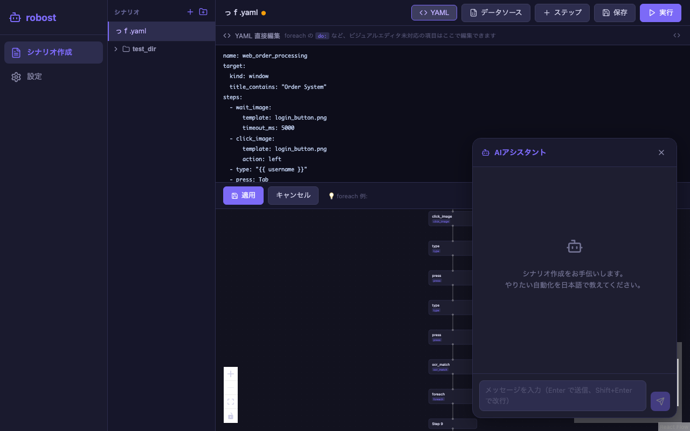
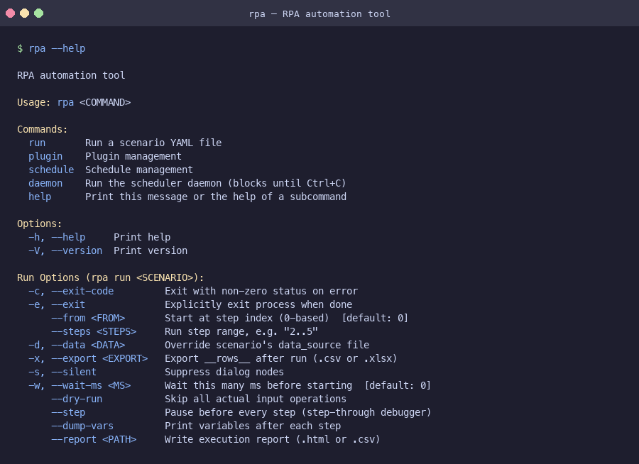

# robost

**robost** = **robo**t（机器人）+ **ro**bu**st**（健壮）+ **Rust**（编程语言）

基于 Rust 的开源桌面自动化 (RPA) 工具。

[English](README.md) | [日本語](README_ja.md) | [详细文档](https://kent-tokyo.github.io/robost/)

## 可视化场景编辑器

| Canvas 视图 — 步骤流程图 | YAML 编辑器 — 直接编辑与实时画布 |
|:---:|:---:|
|  |  |

| AI 助手 — 用自然语言描述自动化 | CLI 帮助 |
|:---:|:---:|
|  |  |

## 下载

> **最新版本**: [GitHub Releases](https://github.com/kent-tokyo/robost/releases/latest)

### Windows — 安装程序（推荐）

**[⬇ robost-setup.exe](https://github.com/kent-tokyo/robost/releases/latest/download/robost-setup.exe)** — 双击安装，无需额外依赖。

- 安装到 `Program Files\robost`，自动创建开始菜单和桌面快捷方式
- 点击快捷方式后浏览器自动打开可视化编辑器
- 可通过 Windows「设置 → 应用」完整卸载

> **SmartScreen 警告**：由于安装程序未进行代码签名，Windows 可能显示「Windows 已保护你的电脑」。
> 请点击**「更多信息」→「仍要运行」**继续安装。这对于没有付费签名证书的开源软件来说是正常现象。

### macOS

| 平台 | 下载 |
|---|---|
| macOS (Apple Silicon) | [rpa-aarch64-apple-darwin.tar.gz](https://github.com/kent-tokyo/robost/releases/latest/download/rpa-aarch64-apple-darwin.tar.gz) |

### Windows — ZIP（高级用户 / 开发者）

| 平台 | 下载 |
|---|---|
| Windows | [rpa-x86_64-windows.zip](https://github.com/kent-tokyo/robost/releases/latest/download/rpa-x86_64-windows.zip) |

## 特性

- **图像识别** — 多尺度 NCC 模板匹配、Tesseract OCR 或 Windows 内置 WinRT OCR（无需安装）、ONNX ML 检测
- **远程桌面支持** — 在本地捕获 RDP/Citrix/VNC 窗口，目标机器无需安装代理
- **瞬态 UI 采集** — 热键冻结屏幕，可以选取平时会消失的下拉菜单和悬浮提示
- **WASM 插件** — 沙箱内运行，插件崩溃不影响主进程
- **纯 YAML 场景** — 支持变量、循环、分支、Rhai 内联脚本、子场景、数据源
- **可视化编辑器** — 列表和 Canvas 视图（自由布局、缩放/平移、迷你地图、网格吸附、对齐/分布）、从自然语言 AI 生成步骤、AI 场景助手（Anthropic/OpenAI）、上下文菜单 tooltip、完整多语言支持（EN/JA/ZH）

## 自动化工具对比

| 功能 | **robost** | WinActor | UiPath | PyAutoGUI | SikuliX | Robot Framework |
|---|---|---|---|---|---|---|
| 许可证 | MIT / Apache-2.0 | 商业授权 | 商业授权 | MIT | MIT | Apache-2.0 |
| 语言 | Rust（YAML 场景） | 专有 GUI | 专有 GUI | Python | Java（Jython） | Python |
| 开源 | 是 | 否 | 否 | 是 | 是 | 是 |
| 远程桌面（RDP/Citrix/VNC） | 是 — 无需代理 | 是 | 是（需要代理） | 否 | 否 | 否 |
| 图像识别 | 是 — 多尺度 NCC | 是 | 是 — AI 辅助 | 否 | 是 — 像素精确 | 否（通过插件） |
| Web 浏览器自动化 | 是 — WebDriver | 是 | 是 | 否 | 否 | 是（SeleniumLibrary） |
| Excel 自动化 | 是 — 单元格/工作表/公式 | 是 | 是 | 否 | 否 | 否（通过插件） |
| Word / PowerPoint | — Phase 2 | 是 | 是 | 否 | 否 | 否 |
| SAP GUI 自动化 | — Phase 2 | 是 | 是 | 否 | 否 | 否 |
| 场景录制 | — Phase 2 | 是 | 是 | 否 | 否 | 否 |
| 编排器（集中管理） | — Phase 3 | 是（有限） | 是 | 否 | 否 | 否 |
| 瞬态 UI 捕获（下拉菜单等） | 是 — 冻结+覆盖层 | 是 | 部分 | 否 | 否 | 否 |
| 多尺度 DPI 适配（125%/150%） | 是 — 内置 | 部分 | 部分 | 否 | 否 | 否 |
| WASM 插件沙箱 | 是 — 内存安全 | 否 | 否 | 否 | 否 | 否 |
| 内联脚本 | 是 — Rhai（沙箱） | 部分 | VB.NET / C# | Python 本身 | Jython | Python |
| 场景版本控制 | 是 — 纯 YAML | 否 | 部分 | 是 — Python | 部分 | 是 — 纯文本 |
| 启动开销 | 约 10 ms（原生二进制） | 数秒 | 数秒 | Python 启动 | JVM 启动（约 2 秒） | Python 启动 |
| OCR 支持 | 是（Tesseract 或 Windows 内置 WinRT，可选） | 是 | 是 | 否 | 部分 | 否（通过插件） |

## 为什么选 robost？

相比 PyAutoGUI 和 SikuliX，最主要的区别是**无需在目标机器安装代理就能操作 RDP/Citrix**。它在本地捕获远程桌面窗口并通过 enigo 发送输入，不依赖对端运行的环境。多尺度 NCC 匹配也能自动处理会让像素精确工具失效的 DPI 缩放（100/125/150%）。

场景格式的节点词汇贴近 WinActor（click_image、wait_image、foreach、dialog_input 等），从现有自动化流程迁移比较直接。场景是纯 YAML，能在文本编辑器里看，用 git 管理变更，不需要专有工具。

插件在 WASM 沙箱里运行：权限在 `plugin.toml` 里声明并在运行时强制检查。插件只能访问它声明过的资源，崩溃了主进程也继续运行。用 Rust、AssemblyScript、Go 或 C 写的插件编译成 `.wasm` 就能集成，不需要 fork 核心。

## 步骤参考

### 图像与视觉
| 步骤 | 说明 |
|---|---|
| `wait_image` | 等待模板图像出现在屏幕上 |
| `click_image` | 找到并点击模板图像 |
| `find_image` | 定位图像并将位置保存到变量 |
| `wait_no_image` | 等待模板图像消失 |
| `match_rect` | 在指定屏幕区域内匹配模板 |
| `screenshot_save` | 将截图保存到文件 |
| `ocr_match` | 通过 OCR 等待文本，保存结果 †ocr/windows-ocr |
| `click_text` | 通过 OCR 找到文本并点击 †ocr/windows-ocr |
| `move_to_text` | 通过 OCR 找到文本并移动光标 †ocr/windows-ocr |
| `ml_detect` | 使用 ONNX ML 模型检测对象 †ml |
| `get_pixel_color` | 读取屏幕像素的 RGB 颜色 |
| `wait_color` | 等待像素变为指定颜色 |
| `wait_change` | 等待指定区域的屏幕像素发生变化 |

### 鼠标与键盘输入
| 步骤 | 说明 |
|---|---|
| `type` | 在活动字段中输入文本 |
| `press` | 按下单个键（Tab、Enter、Escape、F1 等） |
| `key_combo` | 按下组合键（Ctrl+C、Alt+F4 等） |
| `mouse_move` | 将鼠标移动到绝对屏幕坐标 |
| `mouse_click_xy` | 在绝对屏幕坐标处点击 |
| `mouse_drag` | 从一个位置拖动到另一个位置 |
| `mouse_scroll` | 滚动鼠标滚轮 |
| `mouse_hover` | 移动到指定位置并悬停 |
| `click_in_window` | 相对于窗口左上角点击 |

### 剪贴板
| 步骤 | 说明 |
|---|---|
| `clipboard_set` | 将文本写入剪贴板 †clipboard |
| `clipboard_get` | 将剪贴板读取到变量 †clipboard |

### 窗口控制
| 步骤 | 说明 |
|---|---|
| `wait_window` | 等待窗口出现、关闭或变为可操作状态 |
| `window_control` | 聚焦、最大化、最小化或关闭窗口 |

### 流程控制
| 步骤 | 说明 |
|---|---|
| `if` | 条件分支（`then:` / `else:`） |
| `switch` | 按变量值的多路分支 |
| `repeat` | 重复 N 次 |
| `while` | 当 Rhai 条件为真时循环 |
| `do_while` | 直到 Rhai 条件为真时循环（后置判断） |
| `foreach` | 遍历列表变量 |
| `try_catch` | 异常处理（`try:` / `catch:` / `finally:`） |
| `break` | 跳出当前循环 |
| `continue` | 跳到下一次循环迭代 |
| `exit` | 正常结束场景 |
| `group` | 命名步骤组 |
| `wait_until` | 轮询直到 Rhai 条件变为真 |
| `wait_ms` | 休眠 N 毫秒 |

### 子场景与脚本
| 步骤 | 说明 |
|---|---|
| `sub_scenario` | 加载并运行带输入的 YAML 场景文件 |
| `call_scenario` | 通过动态路径变量调用场景 |
| `script` | 执行内联 Rhai 脚本 |
| `library` | 调用内置或插件库函数 |

### 变量操作
| 步骤 | 说明 |
|---|---|
| `set` | 设置变量 |
| `copy_var` | 将一个变量复制到另一个变量 |
| `increment` | 递增数值变量 |
| `calc` | 求值 Rhai 算术表达式 |
| `get_datetime` | 以格式化字符串获取当前日期时间 |
| `get_username` | 获取当前 OS 用户名 |
| `to_fullwidth` | ASCII → 全角字符转换 |
| `to_halfwidth` | 全角 → ASCII 字符转换 |
| `number_random` | 生成随机整数或浮点数 |
| `import_vars` | 从 CSV/XLSX 行导入变量 |
| `save_vars` | 将变量持久化到 JSON 文件 |
| `load_vars` | 从 JSON 文件加载变量 |

### 字符串操作
| 步骤 | 说明 |
|---|---|
| `string_replace` | 替换子字符串 |
| `string_trim` | 去除空白 |
| `string_upper` / `string_lower` | 大小写转换 |
| `string_substring` | 提取子字符串 |
| `string_length` | 获取字符串长度 |
| `string_split` / `string_join` | 分割为数组 / 连接为字符串 |
| `string_regex` | 带捕获组的正则表达式匹配 |
| `string_contains` | 检查是否包含子字符串 |
| `string_starts_with` / `string_ends_with` | 前缀 / 后缀检查 |
| `string_index_of` / `string_count` | 查找索引 / 计数出现次数 |
| `string_format` | 使用 `{0}`、`{1}` 占位符格式化 |
| `base64_encode` / `base64_decode` | Base64 编码 / 解码 |

### 类型转换与列表操作
| 步骤 | 说明 |
|---|---|
| `to_number` / `to_string` / `var_type` | 类型转换或获取类型名 |
| `list_length` / `list_get` | 数组长度 / 按索引获取 |
| `list_push` / `list_remove` / `list_contains` | 数组增删改查 |

### 日期与时间
| 步骤 | 说明 |
|---|---|
| `date_format` | 重新格式化日期字符串 |
| `date_add` | 对日期加减天数、月数、年数 |
| `date_diff` | 计算两个日期之间的差值 |

### 文件与目录
| 步骤 | 说明 |
|---|---|
| `file_exists` / `dir_exists` | 检查是否存在 |
| `file_read` / `file_write` / `file_append` | 读写文本文件 |
| `file_copy` / `file_move` / `file_rename` / `file_delete` | 文件管理 |
| `file_size` / `file_modified_at` | 文件元数据 |
| `file_list` | 按 glob 模式列出文件 †glob-pattern |
| `dir_create` / `dir_delete` | 目录管理 |

### 数据与 JSON
| 步骤 | 说明 |
|---|---|
| `json_parse` / `json_stringify` | 解析 / 序列化 JSON |
| `path_join` / `path_basename` / `path_dirname` | 路径工具 |
| `env_get` | 读取环境变量 |

### 进程与 Shell
| 步骤 | 说明 |
|---|---|
| `shell` | 执行 Shell 命令 |
| `process_start` / `process_kill` / `process_exists` | 进程管理 |
| `wait_process` | 等待进程启动或退出 |

### 系统
| 步骤 | 说明 |
|---|---|
| `log_write` | 在日志文件中追加带时间戳的行 |
| `url_open` | 用默认浏览器打开 URL |
| `notify` | 显示桌面通知 †notify |
| `dialog_wait` / `dialog_input` / `dialog_select` | 用户交互对话框 |

### Excel / CSV / PDF / ZIP
| 步骤 | 说明 |
|---|---|
| `excel_read_cell` / `excel_read_range` / `excel_read_sheet` | 读取 Excel 数据 |
| `excel_write_cell` / `excel_write_range` | 写入 Excel 单元格 / 范围 †excel-write |
| `excel_add_sheet` / `excel_delete_sheet` / `excel_rename_sheet` | 工作表管理 †excel-write |
| `excel_get_dims` / `excel_find_row` | 工作表元数据 / 行搜索 |
| `csv_read` / `csv_write` | 读写 CSV 文件 |
| `pdf_extract_text` / `pdf_page_count` | PDF 文本提取 †pdf |
| `zip_compress` / `zip_extract` / `zip_list` | ZIP 归档操作 †archive |

### HTTP 与邮件
| 步骤 | 说明 |
|---|---|
| `http_get` / `http_post` / `http_put` / `http_patch` / `http_delete` | HTTP 客户端 †http |
| `mail_send` | 通过 SMTP 发送邮件 †mail |
| `mail_receive` | 通过 IMAP 接收邮件 †mail |
| `ftp_upload` / `ftp_download` / `ftp_list` / `ftp_delete` / `ftp_mkdir` | FTP/FTPS 操作 †ftp |

### Web 浏览器（WebDriver）
需要 `feature = "web"` 以及运行中的 chromedriver / geckodriver。

| 步骤 | 说明 |
|---|---|
| `web_open` / `web_close` | 打开 / 关闭浏览器会话 |
| `web_click` / `web_type` / `web_select` | 与元素交互 |
| `web_get` / `web_get_all` | 读取元素文本或属性 |
| `web_wait` / `web_wait_text` | 等待元素 |
| `web_screenshot` | 保存浏览器截图 |
| `web_execute_js` | 执行 JavaScript |
| `web_switch_frame` | 切换到 iframe 或返回顶层 |
| `web_scroll` | 滚动元素或窗口 |
| `web_alert` | 处理 JS 弹窗 / 确认框 |
| `web_get_url` / `web_get_title` | 当前 URL / 页面标题 |
| `web_navigate_back` / `web_navigate_forward` | 浏览器历史导航 |

### Windows UI 自动化
仅限 Windows。

| 步骤 | 说明 |
|---|---|
| `uia_get` / `uia_set` | 按名称、ID 或类获取 / 设置元素属性 |
| `uia_click` | 调用（点击）UIA 元素 |
| `uia_find` | 查找元素并保存其矩形区域 |
| `uia_wait` | 等待元素状态（exists / enabled / visible） |
| `uia_select` | 在 ComboBox / ListBox 中选择项目 |
| `uia_get_children` | 列出子元素 |
| `uia_check` | 选中 / 取消选中复选框 |

### 数据库（SQLite）
| 步骤 | 说明 |
|---|---|
| `db_query` | 查询多行 †db |
| `db_query_one` | 查询单行 †db |
| `db_execute` | 执行 INSERT / UPDATE / DELETE †db |

> **†** 表示需要对应的 Cargo 特性标志。默认 `rpa` 二进制包含除 `ocr`（Tesseract）、`web`、`db`、`ftp` 外的所有特性。

## 架构

```
crates/
├── robost-capture/      # 屏幕/窗口捕获（xcap，DPI 感知）
├── robost-input/        # 鼠标/键盘输入 + 窗口前置（enigo）
├── robost-vision/       # 模板匹配（NCC）、OCR、ML 检测
├── robost-backend/      # Backend trait：本地 / RDP / VNC 统一
├── robost-core/         # 场景引擎：YAML 解析、步骤执行、重试、流程控制
├── robost-snip/         # 模板采集 GUI（托盘应用、热键、叠加层、日文 UI）
├── robost-editor/       # 可视化场景编辑器（列表 + Canvas 视图、AI 步骤生成、AI 聊天、多语言）
├── robost-template/     # 共享坐标/几何类型
├── robost-plugin-api/   # 插件作者公开 API（crates.io 发布候选）
├── robost-plugin-host/  # 基于 wasmtime 的 WASM 插件运行器（带 epoch 超时）
├── robost-script/       # Rhai 内联脚本（沙箱化）
├── robost-stdlib/       # 内置场景节点库
└── robost-cli/          # CLI 二进制
```

## 快速开始

```bash
cargo build --workspace
cargo run -p robost-cli -- run scenario.yaml
```

## 场景格式

```yaml
name: "example"
target:
  kind: window
  title_contains: "MyApp"
variables:
  retry_count: 0
steps:
  # 图像操作
  - wait_image:  { template: login_button.png, timeout_ms: 5000 }
  - click_image: { template: login_button.png, action: left, offset_x: 0, offset_y: 0 }
  - find_image:  { template: icon.png, save_as: pos }  # {found, x, y, score}
  - match_rect:
      template: badge.png
      rect: { x: 100, y: 200, width: 300, height: 100 }
      save_as: result

  # OCR（需要 Tesseract + --features ocr）
  - ocr_match:
      contains: "Login"
      lang: "jpn+eng"
      timeout_ms: 5000
      save_as: ocr_result   # {found, text}

  # 输入操作
  - type: "username"
  - type: { secret_env: PASSWORD }
  - press: Tab

  # 变量操作
  - set:          { name: count, value: 0 }
  - increment:    { name: count, by: 1 }
  - copy_var:     { from: src, to: dst }
  - get_datetime: { format: "%Y%m%d", save_as: today }
  - get_username: { save_as: user }
  - calc:         { expr: "count * 2", save_as: doubled }
  - to_fullwidth: { value: "abc", save_as: full }
  - to_halfwidth: { value: "ａｂｃ", save_as: half }

  # 剪贴板
  - clipboard_set: { value: "{{ text }}" }
  - clipboard_get: { save_as: copied }

  # Shell 执行
  - shell: { cmd: python3, args: [script.py], save_as: output, timeout_ms: 30000 }

  # 流程控制
  - if:
      cond: "count > 10"
      then: [ { press: Escape } ]
      else: [ { wait_ms: 500 } ]
  - switch:
      on: status
      cases:
        - when: "ok"
          do: [ { click_image: { template: ok.png } } ]
      default: [ { press: Escape } ]
  - repeat:  { count: 3, do: [ { wait_ms: 1000 } ] }
  - while:   { cond: "found", do: [ { wait_image: { template: spinner.png } } ] }
  - foreach: { var: __rows__, do: [ { type: "{{ name }}" } ] }
  - try_catch:
      try:   [ { click_image: { template: btn.png } } ]
      catch: [ { set: { name: _error, value: "failed" } } ]
      finally: [ { wait_ms: 100 } ]
  - group:   { name: "login block", do: [ { type: "user" } ] }
  - break
  - continue
  - exit

  # 用户交互（CLI: stdin；静默模式: 使用默认值）
  - dialog_wait:   { message: "Check the screen, then press Enter.", title: "Waiting" }
  - dialog_input:  { message: "Enter filename:", default: "output.xlsx", save_as: fname }
  - dialog_select: { message: "Choose action:", options: [Save, Skip, Abort], save_as: choice }

  # 截图 / 观测
  - screenshot_save: { path: "caps/{{ today }}.png" }                    # 全屏
  - screenshot_save: { path: "caps/win.png", window: "MyApp" }           # 指定窗口
  - wait_no_image:   { template: spinner.png, timeout_ms: 30000 }        # 等待图像消失

  # 系统集成
  - url_open: { url: "https://example.com/report" }
  - notify:   { title: "Done", message: "{{ count }} rows processed" }

  # 窗口操作
  - wait_window:    { title_contains: "MyApp", state: exists, timeout_ms: 10000 }
  - window_control: { title_contains: "Notepad", action: focus }  # focus|maximize|minimize|close

  # 日志输出
  - log_write: { file: run.log, message: "step {{ count }} done", level: info }  # info|warn|error|debug

  # 文件操作
  - file_exists:      { path: data.csv, save_as: exists }
  - file_copy:        { src: a.txt, dst: b.txt }
  - file_move:        { src: tmp.txt, dst: archive/tmp.txt }
  - file_delete:      { path: old.txt }
  - file_rename:      { path: a.txt, name: b.txt }
  - file_list:        { dir: "logs", pattern: "*.log", save_as: files }
  - file_read:        { path: notes.txt, save_as: content }
  - file_write:       { path: out.txt, content: "{{ result }}", mode: overwrite }  # overwrite|append
  - file_append:      { path: out.txt, content: "{{ line }}\n" }
  - file_size:        { path: data.xlsx, save_as: size_bytes }
  - file_modified_at: { path: data.xlsx, format: "%Y-%m-%d %H:%M:%S", save_as: mtime }

  # 目录操作
  - dir_create: { path: "output/logs" }
  - dir_delete: { path: "tmp", recursive: true, ignore_missing: true }
  - dir_exists: { path: "output", save_as: exists }

  # 进程操作
  - process_start:  { command: notepad.exe, wait_ms: 500 }
  - process_kill:   { name: notepad.exe }
  - process_exists: { name: notepad.exe, save_as: running }
  - wait_process:   { name: notepad.exe, state: started, timeout_ms: 10000 }  # started|exited

  # 日期操作
  - date_format: { value: "{{ today }}", format: "%Y/%m/%d", save_as: formatted }
  - date_add:    { value: "{{ today }}", days: 7, save_as: next_week }
  - date_diff:   { from: "{{ start }}", to: "{{ end }}", unit: days, save_as: elapsed }

  # 字符串操作
  - string_replace:   { value: "{{ text }}", from: "old", to: "new", save_as: result }
  - string_trim:      { value: "  hello  ", save_as: trimmed }
  - string_upper:     { value: "{{ text }}", save_as: upper }
  - string_lower:     { value: "{{ text }}", save_as: lower }
  - string_substring: { value: "{{ text }}", start: 0, length: 5, save_as: sub }
  - string_length:    { value: "{{ text }}", save_as: len }
  - string_split:     { value: "a,b,c", delimiter: ",", save_as: parts }
  - string_join:      { value: parts, separator: ", ", save_as: joined }
  - string_regex:     { value: "{{ text }}", pattern: "\\d+", save_as: match }

  # 字符串查询
  - string_contains:    { value: "{{ text }}", search: "hello", save_as: found }
  - string_starts_with: { value: "{{ text }}", search: "http", save_as: found }
  - string_ends_with:   { value: "{{ text }}", search: ".xlsx", save_as: found }
  - string_index_of:    { value: "{{ text }}", search: ":", save_as: pos }  # 0-based；未找到返回 -1
  - string_count:       { value: "hello world hello", search: "hello", save_as: n }

  # 字符串格式化 / Base64
  - string_format: { format: "你好，{0}！共 {1} 条", args: [name, count], save_as: msg }
  - base64_encode: { value: "{{ content }}", save_as: encoded }
  - base64_decode: { value: "{{ encoded }}", save_as: decoded }

  # JSON / 路径 / 环境变量
  - json_parse:     { value: "{\"k\":1}", save_as: obj }
  - json_stringify: { value: "{{ obj }}", save_as: json_str }
  - path_join:      { parts: ["dir", "sub", "file.txt"], save_as: full_path }
  - path_basename:  { path: "/dir/file.txt", save_as: name }
  - path_dirname:   { path: "/dir/file.txt", save_as: dir }
  - env_get:        { name: HOME, save_as: home_dir }

  # 鼠标坐标操作
  - mouse_move:      { x: 500, y: 300 }
  - mouse_click_xy:  { x: 500, y: 300, button: left }  # left|right|double
  - mouse_drag:      { from_x: 100, from_y: 100, to_x: 400, to_y: 400, hold_ms: 100 }
  - mouse_scroll:    { direction: down, amount: 3 }    # up|down|left|right
  - mouse_hover:     { x: 500, y: 300, hover_ms: 500 }
  - click_in_window: { window: "Notepad", x: 100, y: 50, action: left }  # left|right|double

  # 组合键
  - key_combo: { keys: [ctrl, c] }           # Ctrl+C
  - key_combo: { keys: [ctrl, shift, tab] }  # Ctrl+Shift+Tab

  # CSV 操作
  - csv_read:  { path: data.csv, has_header: true, save_as: rows }
  - csv_write: { path: out.csv, rows: "{{ rows }}", mode: overwrite }  # overwrite|append

  # HTTP（需要 feature = "http"）
  - http_get:    { url: "https://api.example.com/items", save_as: resp }
  - http_post:   { url: "https://api.example.com/items", body: "{{ payload }}", save_as: resp }
  - http_put:    { url: "https://api.example.com/items/1", body: "{{ payload }}", save_as: resp }
  - http_delete: { url: "https://api.example.com/items/1", save_as: resp }
  - http_patch:  { url: "https://api.example.com/items/1", body: "{{ patch }}", save_as: resp }
  # 带身份验证
  - http_get:    { url: "https://api.example.com/secure", auth: { basic: { user: "u", password: "p" } }, save_as: resp }
  - http_post:   { url: "https://api.example.com/secure", body: "{{ payload }}", auth: { bearer: { token: "{{ tok }}" } }, save_as: resp }

  # Excel 单元格 / 范围（写操作需要 feature = "excel-write"）
  - excel_read_cell:   { file: data.xlsx, sheet: Sheet1, cell: A2, save_as: cell_val }
  - excel_read_range:  { file: data.xlsx, sheet: Sheet1, range: "A2:Z10", save_as: table }
  - excel_write_cell:  { file: data.xlsx, sheet: Sheet1, cell: A2, value: "{{ result }}" }
  - excel_write_range: { file: data.xlsx, sheet: Sheet1, cell: A2, data: "{{ rows }}" }

  # Excel 工作表管理（需要 feature = "excel-write"）
  - excel_add_sheet:    { file: data.xlsx, name: NewSheet }
  - excel_delete_sheet: { file: data.xlsx, name: OldSheet }
  - excel_rename_sheet: { file: data.xlsx, from_name: Sheet1, to_name: Data }
  - excel_read_sheet:   { file: data.xlsx, sheet: Sheet1, has_header: true, save_as: rows }
  - excel_get_dims:     { file: data.xlsx, sheet: Sheet1, save_as: dims }  # {rows, cols}
  - excel_find_row:     { file: data.xlsx, col: A, value: "{{ search }}", save_as: row_num }  # 1-based 或 -1

  # 邮件（IMAP 接收 / SMTP 发送）
  - mail_receive:
      host: "imap.example.com"
      user: "{{ env_user }}"
      password: "{{ env_pass }}"
      folder: INBOX
      count: 10
      only_unseen: true
      save_as: emails   # [{subject, from, date, body, seen}]
  - mail_send:
      host: "smtp.example.com"
      user: "{{ env_user }}"
      password: "{{ env_pass }}"
      from: "bot@example.com"
      to: "user@example.com"
      subject: "周报"
      body: "{{ report }}"

  # Webhook 通知
  - notify_slack: { url: "{{ SLACK_WEBHOOK }}", message: "{{ count }} rows processed" }
  - notify_teams: { url: "{{ TEAMS_WEBHOOK }}", title: "Done", message: "{{ count }} rows processed" }

  # 操作系统密钥链（macOS Keychain / Windows 凭据管理器 / Linux Secret Service）
  - keychain_set:    { service: myapp, account: api_key, value: "{{ secret }}" }
  - keychain_get:    { service: myapp, account: api_key, save_as: secret }
  - keychain_delete: { service: myapp, account: api_key }

  # 调度器（参见 `rpa schedule` CLI）
  # 场景通过 cron 触发 — 无需内联步骤

  # 像素 / 颜色
  - get_pixel_color: { x: 500, y: 300, save_as: col }       # {r, g, b, hex}
  - wait_color:      { x: 500, y: 300, color: "#00FF00", tolerance: 10, timeout_ms: 10000 }

  # UI Automation（仅 Windows）
  - uia_get:          { by: { name: "用户名" }, property: value, save_as: text }  # name|value|class|rect
  - uia_set:          { by: { name: "用户名" }, value: "user@example.com" }
  - uia_click:        { by: { name: "确定" } }
  - uia_find:         { by: { id: "btnSubmit" }, save_as: elem }   # {x, y, width, height, name}
  - uia_wait:         { by: { name: "确定" }, state: enabled, timeout_ms: 10000 }  # exists|enabled|visible
  - uia_select:       { by: { name: "国家" }, item: "Japan" }
  - uia_get_children: { by: { name: "文件" }, save_as: items }     # [{name, value, class}]
  - uia_check:        { by: { name: "同意条款" }, checked: true }

  # Web 浏览器自动化（需要 feature = "web"；先启动 chromedriver/geckodriver）
  - web_open:             { url: "https://example.com", driver: "http://localhost:4444" }
  - web_close: ~
  - web_click:            { selector: "#submit", timeout_ms: 5000 }
  - web_type:             { selector: "#username", text: "user", clear: true }
  - web_get:              { selector: ".result", save_as: text }
  - web_get:              { selector: ".result", attr: "href", save_as: link }
  - web_wait:             { selector: "#spinner", timeout_ms: 10000 }
  - web_wait_text:        { selector: "#status", text: "完成", timeout_ms: 10000 }
  - web_screenshot:       { path: "screens/page.png" }
  - web_select:           { selector: "#country", item: "Japan" }
  - web_execute_js:       { script: "return document.title;", save_as: title }
  - web_switch_frame:     { selector: "#iframe1" }
  - web_switch_frame:     { index: 0 }
  - web_switch_frame: ~                                              # 返回顶层
  - web_scroll:           { y: 300 }                                 # 页面滚动
  - web_scroll:           { selector: "#list", y: 100 }             # 元素滚动
  - web_alert:            { action: accept }                         # accept|dismiss|get_text
  - web_navigate_back: ~
  - web_navigate_forward: ~
  - web_get_url:          { save_as: current_url }
  - web_get_title:        { save_as: page_title }
  - web_get_all:          { selector: ".item", save_as: items }      # 所有元素的文本
  - web_get_all:          { selector: "a", attr: "href", save_as: links }  # 所有链接的 href

  # 类型转换
  - to_number: { value: "42.5", save_as: n }
  - to_string: { value: "{{ count }}", save_as: s }
  - var_type:  { value: "{{ obj }}", save_as: type_name }  # "string"|"number"|"bool"|"array"|"object"|"null"

  # 列表操作
  - list_length:   { list: items, save_as: len }
  - list_get:      { list: items, index: "0", save_as: first }
  - list_push:     { list: items, value: "{{ new_item }}" }
  - list_remove:   { list: items, index: "0" }
  - list_contains: { list: items, value: "target", save_as: found }

  # 随机数
  - number_random: { min: 1, max: 100, integer: true, save_as: n }

  # foreach 带索引变量
  - foreach:
      var: rows
      index_var: i   # 可选的 0-based 计数器
      do:
        - log_write: { file: run.log, message: "{{ i }}: {{ item }}" }

  # 变量持久化
  - import_vars: { path: params.xlsx, row: 2 }
  - save_vars:   { path: state.json, vars: [count, status] }
  - load_vars:   { path: state.json }

  # 子场景与脚本
  - sub_scenario:   { path: sub/login.yaml, inputs: { user: "{{ user }}" } }
  - call_scenario:  { path: "{{ path }}", save_as: result }
  - script:         { script: "let d = now(); d.format(\"%Y%m%d\")", save_as: date }
  - library:        { name: "excel-reader.read_sheet", inputs: { path: data.xlsx }, save_as: rows }
```

## 数据源

逐行加载 Excel/CSV，列标题自动映射为变量名：

```yaml
data_source:
  file: data.xlsx
  sheet: Sheet1
steps:
  - foreach: { var: __rows__, do: [ { type: "{{ 氏名 }}" } ] }
```

运行后导出结果：

```bash
cargo run -p robost-cli -- run scenario.yaml --export result.xlsx
```

## 模板采集（robost-snip）

1. `cargo run -p robost-snip` — 以托盘应用方式启动（无窗口，不抢占焦点）
2. 打开目标 UI（下拉菜单、对话框、悬浮提示等）
3. 按 **Ctrl+Shift+C**（或使用托盘菜单）— 将屏幕冻结为全屏叠加层
4. 拖动选择模板区域
5. 可选：添加**锚点**（单击参考目标）和**遮罩区域**（排除时间戳等动态内容）
6. 点击 匹配测试 验证对冻结屏幕的匹配效果
7. **保存** — PNG + 元数据 YAML 写入 `templates/`；自动生成多尺度变体（125%、150%）

## 插件系统

插件以 `.wasm` + `plugin.toml` 的形式配对分发。在 WASM 沙箱中运行，必须声明权限。

```bash
# 构建插件（独立 workspace）
cargo build -p my-plugin --target wasm32-wasip2

# 带权限审查安装
cargo run -p robost-cli -- plugin install ./my-plugin.wasm

# 跳过确认自动安装
cargo run -p robost-cli -- plugin install ./my-plugin.wasm -y

# 在场景中使用
# - library: { name: "my-plugin.function", inputs: { key: value }, save_as: result }
```

## CLI 参考

```
rpa run <scenario.yaml> [选项]

  --from <N>         从第 N 步开始执行（0-based）
  --steps <S..E>     执行步骤范围，例如 "2..5"
  --data <path>      覆盖 data_source 文件
  --export <path>    运行后导出 __rows__（.csv 或 .xlsx）
  --silent           使用默认值自动回答所有对话框
  --wait-ms <ms>     启动后等待 N 毫秒再执行
  --exit             完成后退出进程

rpa plugin install <path.wasm> [-y]
rpa plugin list

rpa schedule add --cron "<expr>" --scenario <path.yaml> [--name <name>]
rpa schedule list
rpa schedule remove <id|name>
rpa schedule run           # 启动调度器守护进程
```

## OCR 功能

### Windows 内置 OCR（无需安装 Tesseract）

Windows 10/11 内置 `Windows.Media.Ocr` OCR 引擎，无需额外安装：

```bash
cargo build --features windows-ocr
```

需要安装语言包：**设置 → 时间和语言 → 语言和区域 → 添加语言**，然后为该语言安装**光学字符识别**可选功能。

### Tesseract OCR（macOS / Linux / Windows）

使用 Tesseract 的 OCR 需要在宿主机上安装：

```bash
# macOS
brew install tesseract tesseract-lang

# Ubuntu / Debian
sudo apt install tesseract-ocr tesseract-ocr-jpn tesseract-ocr-eng

# Windows: https://github.com/UB-Mannheim/tesseract/wiki
```

启用 `ocr` feature 进行构建：

```bash
cargo build --features ocr
```

## 可选功能

robost-core 和 robost-stdlib 提供 Cargo 特性标志。CLI 二进制文件（`rpa`）默认启用所有常用功能。

| 特性 | Crate | 启用的功能 |
|---|---|---|
| `mail` | robost-core | SMTP 发送（`mail_send`）和 IMAP 接收（`mail_receive`） |
| `pdf` | robost-core | PDF 文本提取（`pdf.extract_text`、`pdf.page_count`） |
| `archive` | robost-core | ZIP 压缩/解压（`archive.compress`、`archive.extract`） |
| `keychain` | robost-core | 系统密钥链访问（`keychain_set`、`keychain_get`、`keychain_delete`） |
| `notify` | robost-core | 桌面通知（`notify`） |
| `clipboard` | robost-core | 剪贴板读写（`clipboard_get`、`clipboard_set`） |
| `glob-pattern` | robost-core | 文件列表 glob 模式（`file_list`） |
| `http` | robost-core | HTTP 客户端（`http_get`、`http_post` 等） |
| `excel-write` | robost-core | Excel 单元格/范围写入（`excel_write_cell`、`excel_write_range` 等） |
| `ocr` | robost-core | Tesseract OCR（`ocr_match`、`click_text`） |
| `windows-ocr` | robost-core | Windows 内置 WinRT OCR（无需 Tesseract） |
| `web` | robost-core | WebDriver 浏览器自动化（`web_open`、`web_click` 等） |
| `db` | robost-core | SQLite 数据库（`db.query`、`db.execute`） |
| `ftp` | robost-core | FTP/FTPS 客户端（`ftp.upload`、`ftp.download` 等） |

最小构建（仅核心图像/输入/YAML）:
```bash
cargo build -p robost-cli --no-default-features
```

完整构建（与默认相同）:
```bash
cargo build -p robost-cli
```

## 开发命令

```bash
cargo build --workspace
cargo test --workspace
cargo clippy --workspace --all-targets -- -D warnings
cargo fmt --all

cargo run -p robost-snip          # 模板采集工具
cargo run -p robost-editor        # 可视化场景编辑器
```

## 已发布的 Crate

所有 crate 均以 v0.1.0 发布于 [crates.io](https://crates.io/)。

| Crate | 说明 |
|---|---|
| [robost](https://crates.io/crates/robost) | 元 crate |
| [robost-vision](https://crates.io/crates/robost-vision) | 多尺度 NCC 模板匹配、OCR、ML 检测 |
| [robost-capture](https://crates.io/crates/robost-capture) | 跨平台屏幕/窗口截图 |
| [robost-input](https://crates.io/crates/robost-input) | 鼠标/键盘输入模拟 |
| [robost-template](https://crates.io/crates/robost-template) | 坐标与模板共享类型 |
| [robost-backend](https://crates.io/crates/robost-backend) | 统一后端 trait（本地/RDP/VNC）|
| [robost-core](https://crates.io/crates/robost-core) | YAML 场景引擎 |
| [robost-stdlib](https://crates.io/crates/robost-stdlib) | 内置场景节点库 |
| [robost-script](https://crates.io/crates/robost-script) | Rhai 内联脚本 |
| [robost-plugin-api](https://crates.io/crates/robost-plugin-api) | 插件作者 API |
| [robost-plugin-host](https://crates.io/crates/robost-plugin-host) | WASM 插件运行器（wasmtime）|
| [robost-uia](https://crates.io/crates/robost-uia) | Windows UI Automation |
| [robost-web](https://crates.io/crates/robost-web) | WebDriver 浏览器自动化 |
| [robost-editor](https://crates.io/crates/robost-editor) | 可视化场景编辑器 |
| [robost-snip](https://crates.io/crates/robost-snip) | 模板截取托盘应用 |
| [robost-cli](https://crates.io/crates/robost-cli) | CLI 运行器（`rpa` 二进制）|

## 许可证

MIT OR Apache-2.0

## 路线图

| 阶段 | 状态 | 主要内容 |
|---|---|---|
| **Phase 1** | 已完成 | 200+ 场景节点 · CLI · 可视化编辑器（AI 聊天·拖放·多语言）· snip 工具 · Web/UIA/Excel/Mail/OCR/调度器 · 所有 crate 已发布至 crates.io |
| **Phase 2** | 计划中 | 场景录制 · Word/SFTP/ML 检测/并行执行/注册表/M365 |
| **Phase 3** | 未来 | 编排器 · 队列模型 · AI 辅助场景生成 |
